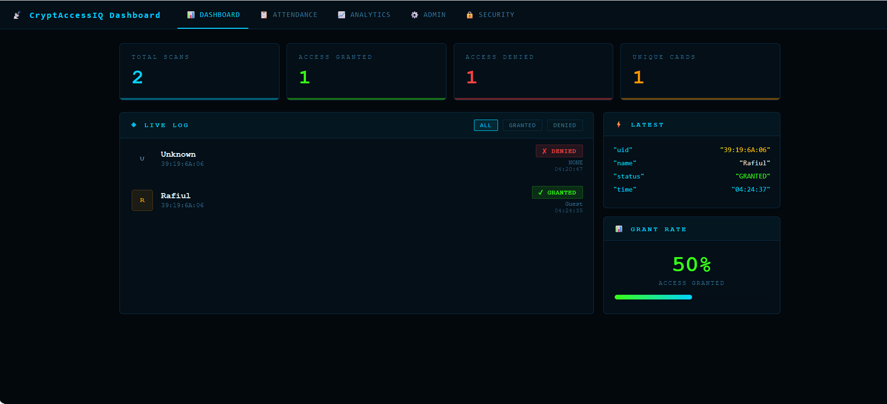
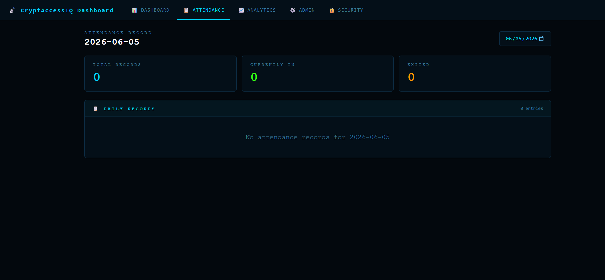
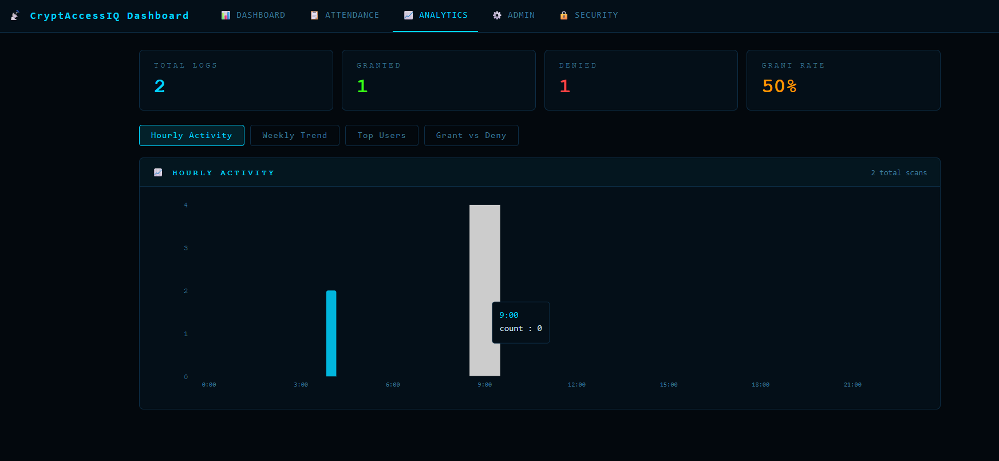
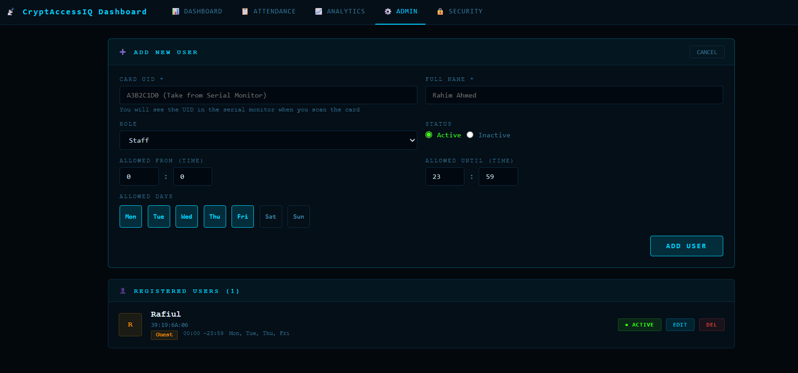
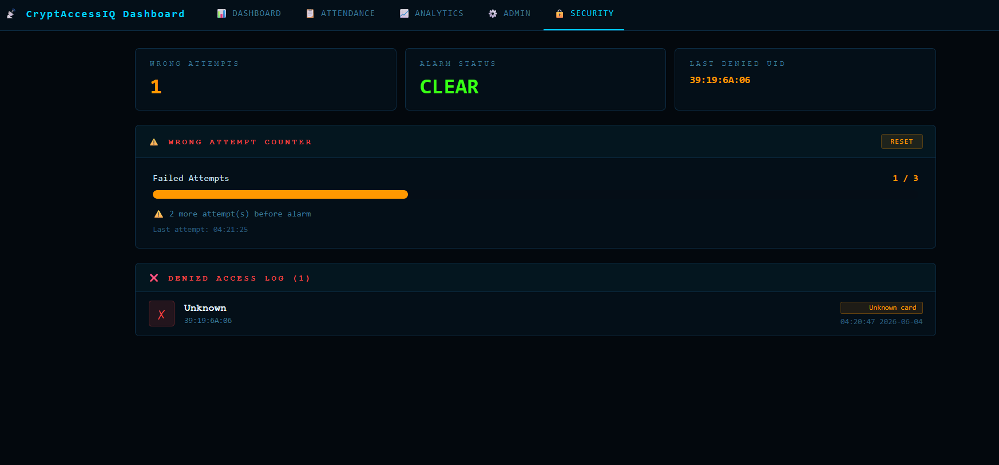
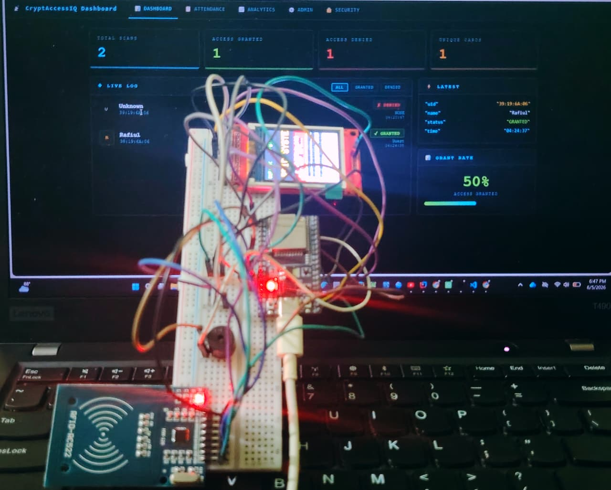

# 🔐 Crypt_AccessIQ

<div align="center">


**A full-stack IoT Access Control System powered by ESP32, Firebase Realtime Database, and a React dashboard.**
**Featuring RFID-based authentication, real-time attendance tracking, analytics, and security monitoring.**

[Features](#-features) · [Hardware](#-hardware-requirements) · [Wiring](#-wiring) · [Getting Started](#-getting-started) · [Dashboard](#-dashboard-preview) · [Firebase Structure](#-firebase-data-structure) · [Troubleshooting](#-troubleshooting)

</div>

---

## 📌 Overview

**Crypt_AccessIQ** is an end-to-end smart access control solution that uses RFID cards to grant or deny entry, logs all events to Firebase Realtime Database in real time, and presents a live React dashboard for monitoring, analytics, and administration.

It is designed for educational institutions, labs, and small offices requiring a lightweight, deployable access control system without enterprise-level hardware.

---

## ✨ Features

| Feature | Description |
|--------|-------------|
| 🔐 **UID-based Access Control** | Authenticates users by RFID card UID against a Firebase-managed allowlist |
| 📋 **Attendance Tracking** | Logs entry/exit timestamps and computes session duration per user per day |
| ⏰ **Time-Restricted Access** | Configurable allowed hours and days per individual user |
| 🚨 **Intrusion Detection** | Triggers alarm after 3 consecutive failed scan attempts within a 2-minute window |
| 📊 **Real-time Dashboard** | Live access log feed with scan status, user info, and timestamps |
| 📈 **Analytics** | Hourly activity heatmap, weekly trends, top users, and grant/deny ratio |
| ⚙️ **Admin Panel** | Full CRUD for user management — add, edit, delete, activate/deactivate users |
| 🖥️ **Local TFT Display** | On-device access result shown via ILI9341 display |
| 🔔 **Buzzer Feedback** | Distinct beep patterns for GRANTED vs DENIED responses |

---

## 🖥️ Dashboard Preview

### Overview — Live Access Feed


### Attendance — Daily Records


### Analytics — Charts & Heatmap


### Admin Panel — User Management


### Security — Intrusion Monitoring


---

## 🔧 Hardware Setup

<p align="center">
  
</p>

<p align="center">
  <b>Complete Crypt_AccessIQ Hardware Prototype</b><br>
  ESP32 + RC522 RFID + ILI9341 TFT + Buzzer
</p>

### Components

| Component | Qty | Notes |
|-----------|-----|-------|
| ESP32 DevKit V1 | 1 | Main microcontroller — built-in WiFi (2.4 GHz only) |
| RC522 RFID Module | 1 | 13.56 MHz — **3.3V logic only! Do NOT use 5V** |
| RFID Cards / Key Fobs | 2+ | MIFARE Classic 1K compatible |
| ILI9341 TFT Display | 1 | 240×320, SPI interface |
| Active Buzzer | 1 | 3.3V or 5V |
| Jumper Wires | — | Male-to-Female |
| Breadboard | 1 | Full-size recommended |

---

## 🔌 Wiring

### RC522 RFID → ESP32

| RC522 Pin | ESP32 Pin |
|-----------|-----------|
| VCC | **3.3V** ⚠️ |
| GND | GND |
| RST | GPIO 22 |
| SDA (SS) | GPIO 21 |
| MOSI | GPIO 23 |
| MISO | GPIO 19 |
| SCK | GPIO 18 |

> ⚠️ **Critical:** RC522 operates at **3.3V only**. Connecting to 5V will permanently damage the module.

### TFT LCD Display → ESP32

| TFT Pin | ESP32 Pin |
|---------|-----------|
| CS | GPIO 15 |
| DC / RS | GPIO 2 |
| RST | GPIO 4 |
| MOSI | GPIO 23 *(shared SPI bus)* |
| SCK | GPIO 18 *(shared SPI bus)* |
| MISO | GPIO 19 *(shared SPI bus)* |

> ℹ️ TFT and RC522 share the same VSPI bus — differentiated by individual CS pins.

### Additional Components

| Component | ESP32 Pin |
|-----------|-----------|
| Buzzer (+) | GPIO 32 |
| Buzzer (−) | GND |
| SD Card CS | GPIO 27 |

---

## 🗂️ Project Structure

```
Crypt_AccessIQ/
│
├── 📁 esp32_firmware/                  ← PlatformIO ESP32 Firmware
│   ├── platformio.ini
│   ├── include/
│   │   ├── config.h                    ← WiFi + Firebase credentials (gitignored)
│   │   ├── config.example.h            ← Template — copy and fill in credentials
│   │   └── user_cache.h                ← User struct and local cache
│   └── src/
│       └── main.cpp                    ← Core firmware logic
│
├── 📁 Dashboard/                       ← React Frontend
│   ├── package.json
│   ├── public/
│   │   └── index.html
│   └── src/
│       ├── App.js
        ├── index.js
        ├── index.css
│       ├── firebase.js                 ← Firebase config (gitignored)
│       └── components/
│           ├── Overview.jsx
│           ├── Attendance.jsx
│           ├── Analytics.jsx
│           ├── AdminPanel.jsx
│           └── Security.jsx
│
├── 📁 docs/
│   └── screenshots/                    ← Dashboard screenshots
│
├── .gitignore
├── LICENSE
└── README.md
```

---

## 🚀 Getting Started

### Prerequisites

* [VSCode](https://code.visualstudio.com/) + [PlatformIO Extension](https://platformio.org/install/ide?install=vscode)
* [Node.js](https://nodejs.org/) v18 or later
* [Firebase Account](https://console.firebase.google.com/) (free Spark plan is sufficient)

---

### Step 1 — Firebase Setup

1. Go to [console.firebase.google.com](https://console.firebase.google.com/) → **Add Project**
2. **Build → Realtime Database → Create Database → Test Mode**
3. Set database rules:

```json
{
  "rules": {
    "rfid": {
      ".read": "true",
      ".write": "true"
    }
  }
}
```

4. **Project Settings → Your Apps → Web App** → Copy `firebaseConfig`

---

### Step 2 — ESP32 Firmware

```bash
# 1. Copy the config template
cp esp32_firmware/include/config.example.h esp32_firmware/include/config.h
```

Edit `config.h`:

```cpp
#define WIFI_SSID              "Your_WiFi_SSID"
#define WIFI_PASSWORD          "Your_WiFi_Password"
#define FIREBASE_API_KEY       "AIzaSy_your_api_key"
#define FIREBASE_DATABASE_URL  "https://your-project-rtdb.firebaseio.com"
```

Flash to ESP32: **`Ctrl + Alt + U`** in VSCode, then open Serial Monitor at **115200 baud**.

---

### Step 3 — React Dashboard

```bash
cd Dashboard
cp src/firebase.example.js src/firebase.js
# Edit firebase.js with your Firebase config
npm install
npm start
```

Open [http://localhost:3000](http://localhost:3000)

---

### Step 4 — Add Users

1. Scan your RFID card — note the UID from Serial Monitor (e.g., `A3:B2:C1:D0`)
2. Open Dashboard → **Admin** tab → **+ ADD USER**
3. Enter UID without colons: `A3B2C1D0`
4. Fill in name, role, allowed hours, days → **ADD USER**
5. ESP32 syncs within 5 minutes, or restart to load immediately

---

## 🔥 Firebase Data Structure

```
rfid/
├── latest/          ← Most recent scan
│   ├── uid
│   ├── name
│   ├── status       "GRANTED" | "DENIED"
│   └── time
│
├── logs/            ← Complete access history
│   └── 0/ → { uid, name, role, status, reason, time, date }
│
├── users/           ← Authorized user registry
│   └── A3B2C1D0/ → { name, role, active, startHour, endHour, days[] }
│
├── attendance/      ← Daily records
│   └── 2025-01-15/
│       └── A3B2C1D0/ → { entry, exit, duration, status }
│
└── security/        ← Intrusion detection
    ├── wrongAttempts
    ├── alarmActive
    └── lastDeniedUID
```

---

## ⚙️ Configuration Reference

| Constant | Default | Description |
|----------|---------|-------------|
| `NTP_OFFSET` | `21600` | UTC+6 (Bangladesh) |
| `WRONG_ATTEMPT_MAX` | `3` | Failed attempts before alarm |
| `WRONG_ATTEMPT_WINDOW` | `120000` | Reset window (2 min) |
| `DOOR_OPEN_MS` | `3000` | Access granted hold duration |
| `DEBOUNCE_MS` | `1500` | Same-card re-scan block |
| `USER_REFRESH_MS` | `300000` | Firebase cache refresh (5 min) |
| `MAX_USERS` | `30` | Max users in ESP32 cache |

---

## 🔮 Roadmap

* [ ] Telegram Bot notifications
* [ ] Email alerts on alarm trigger
* [ ] Multi-door support
* [ ] Monthly attendance PDF export
* [ ] OTA firmware updates

---

## 🛠️ Troubleshooting

| Symptom | Fix |
|---------|-----|
| Card not detected | Verify SPI wiring: MOSI=23, MISO=19, SCK=18, SS=21, RST=22 |
| TFT screen blank | Check CS=15, DC=2, RST=4. Confirm ILI9341 driver in platformio.ini |
| WiFi not connecting | ESP32 supports **2.4 GHz only** |
| Firebase not syncing | Verify API key and DB URL in config.h |
| Users not loading | Restart ESP32 or wait 5 minutes |
| Upload fails | Hold **BOOT** button during upload |

---

## 📄 License

MIT License — free to use, modify, and distribute with attribution.

---

<div align="center">

**Crypt_AccessIQ** — Developed by Rafiul Islam · ESP32 · React · Firebase

</div> 
